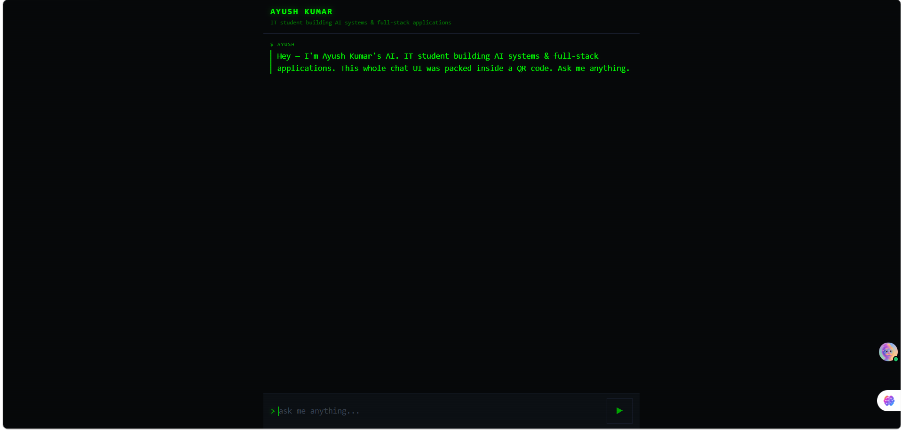

<div align="center">

# 🚀 ScanMind AI

### AI Assistant. Inside a QR Code.

**One Scan. Zero Installs. Instant AI.**


</div>

---

# 📖 About

**ScanMind AI** is a next-generation AI chat interface embedded inside a **QR Code**.

Instead of redirecting users to a website or requiring an app, the QR code contains a highly compressed HTML, CSS, and JavaScript application. Once scanned, the browser reconstructs the interface instantly and securely connects to an AI backend powered by **Cloudflare Workers**.

The AI model is **stored inside the QR code**This makes ScanMind AI fast, secure, and incredibly portable.

---

# ✨ Features

- 📱 No Mobile App Required
- 🌐 No Website Required
- 🤖 AI-Powered Chat Interface
- ⚡ Instant Loading
- 🔒 Secure Cloudflare Worker Backend
- 📦 Ultra Compressed Frontend
- 🧠 Personalized AI Assistant
- 🎤 Voice Ready (Upcoming)
- 🌙 Dark Mode
- 📜 Markdown Support
- 📋 Copy Responses
- ⚡ Streaming AI Responses
- 🔑 API Keys Never Exposed

---

# 🖼️ Preview

## Chat Interface



## QR Scan


---

# 🏗️ Architecture

```text
        QR Code
           │
           ▼
Compressed HTML/CSS/JS
           │
           ▼
Browser Decompresses
           │
           ▼
AI Chat Interface
           │
           ▼
Cloudflare Worker
           │
           ▼
OpenAI / Gemini API
```

---

# ⚙️ Compression Pipeline

```text
HTML
   │
CSS
   │
JavaScript
   │
▼
Minify
   │
▼
Gzip Compression
   │
▼
Base64 Encoding
   │
▼
Embed into QR
```

---

# 🛠️ Tech Stack

| Technology | Purpose |
|------------|---------|
| HTML5 | UI |
| CSS3 | Styling |
| JavaScript | Application Logic |
| Pako.js | Gzip Compression |
| Base64 | Encoding |
| QR Generator | QR Creation |
| Cloudflare Workers | Backend |
| OpenAI / Gemini | AI Responses |

---

# 📂 Project Structure

```
ScanMind-AI
│
├── assets
│   ├── banner.png
│   ├── home.png
│   ├── chat.png
│   └── qr-demo.png
│
├── client
│   ├── index.html
│   ├── style.css
│   └── app.js
│
├── worker
│   └── worker.js
│
├── scripts
│   └── build.js
│
├── compressed
│   └── payload.txt
│
├── qr
│   └── scanmind.png
│
├── package.json
└── README.md
```

---

# 🚀 Getting Started

## Clone Repository

```bash
git clone https://github.com/ayur546411-design/ScanMind AI — An AI assistant that lives inside a QR code.git
```

---

## Install Dependencies

```bash
npm install
```

---

## Start Development

```bash
npm run dev
```

---

## Build Project

```bash
npm run build
```

---

# 🔒 Security

- API keys never appear inside the QR Code.
- AI requests go through Cloudflare Workers.
- Per-IP rate limiting.
- Secure environment variables.
- CORS protection.

---

# 📈 Performance

- ⚡ ~2.7 KB compressed frontend
- 🚀 Instant loading
- 📱 Mobile optimized
- 🌐 Cross-browser compatible
- 📦 Highly optimized assets

---

# 🎯 Future Roadmap

- [ ] Voice Chat
- [ ] Image Upload Support
- [ ] AI Memory
- [ ] Offline Mode
- [ ] Resume Assistant
- [ ] Portfolio AI
- [ ] Multi-language Support
- [ ] End-to-End Encryption

---

# 🤝 Contributing

Contributions are welcome!

```bash
Fork 🍴

Clone 📥

Create Feature Branch 🌱

Commit Changes 💻

Push 🚀

Open Pull Request 🎉
```

---

# ⭐ Support

If you like this project,

⭐ Star this repository

🍴 Fork it

💬 Share it

---

# 📄 License

This project is licensed under the **MIT License**.

---

<div align="center">

## Made with ❤️ by Ayush Kumar

### ⭐ One Scan. Zero Installs. Instant AI.

</div>
